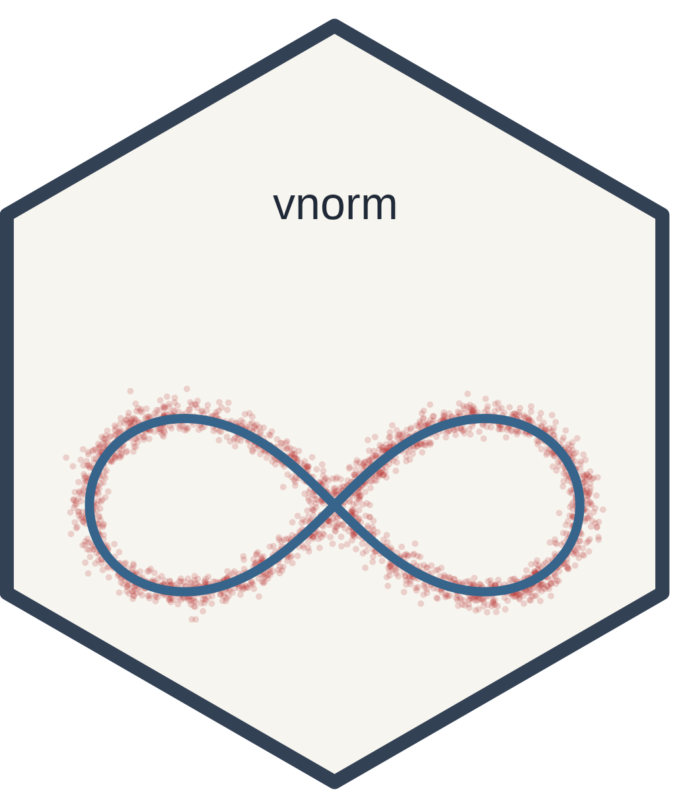

<!-- README.md is generated from README.Rmd. Please edit that file -->

```{r, include = FALSE}
knitr::opts_chunk$set(
  collapse = TRUE,
  comment = "#>",
  fig.path = "man/figures/README-",
  out.width = "72%",
  out.extra = 'style="display:block; margin: 0 auto;"',
  fig.width = 4.8,
  fig.height = 3.0,
  fig.align = "center"
)
```

```{r, include = FALSE}
library(vnorm)
library(mpoly)
library(ggplot2)
```

# vnorm



[CRAN status](https://cran.r-project.org/package=vnorm)
[](https://cran.r-project.org/package=vnorm)
[](https://www.repostatus.org/#active)
[](https://app.codecov.io/gh/sonish13/vnorm)

`vnorm` provides tools for sampling, visualizing, and projecting near real
algebraic varieties defined by polynomial equations. It implements the variety
normal distribution using `mpoly` for polynomial representations and
Stan-based samplers. In addition to sampling with `rvnorm()`, the package
includes pseudo-density evaluation via `pdvnorm()`, ggplot2 visualization with
`geom_variety()`, and projection onto varieties with `project_onto_variety()`.

## Installation

You can install the development version of `vnorm` from GitHub with:

``` r
if (!requireNamespace("devtools")) install.packages("devtools")
devtools::install_github("dkahle/mpoly")
devtools::install_github("sonish13/vnorm")
```

`rvnorm()` uses Stan/HMC as the primary sampling backend, so you should install
`cmdstanr` and CmdStan for normal package use. A rejection sampler interface is
also available (`rejection = TRUE`) and can be useful for quick examples or
simple low-dimensional cases.

## Quick Start: Sample and Plot a Variety

The main workflow is: define a polynomial variety, sample near it with
`rvnorm()`, and visualize with `geom_variety()`.

Stan/HMC (primary path):

```{r fig.width = 4.8, fig.height = 3.4, message = FALSE}
p1 <- mp("x^2 + y^2 - 1")
samps1 <- rvnorm(
  2000,
  poly = p1,
  sd = 0.1,
  output = "tibble"
)

ggplot(samps1, aes(x, y)) +
  geom_point(size = 0.4) +
  geom_variety(poly = p1, inherit.aes = FALSE, show.legend = FALSE) +
  coord_equal() +
  theme_minimal()
```

## Main Functions

- `rvnorm()` samples from a variety normal distribution near a polynomial variety.
- `pdvnorm()` evaluates the pseudo-density (up to a normalizing constant).
- `geom_variety()` plots real 1D varieties in 2D using `ggplot2`.
- `project_onto_variety()` projects points onto a variety.
- `compile_stan_code()` pre-compiles reusable Stan models for repeated sampling
  with related polynomial forms.

### `rvnorm()`: the main sampling function

`rvnorm()` is the main entry point for sampling near varieties defined by one
polynomial (`mpoly`) or a system of polynomials (`mpolyList`). It supports:

- Stan/HMC sampling (default; best for most serious use)
- rejection sampling (`rejection = TRUE`; good for quick examples and simple cases)
- built-in pre-compiled Stan models (`pre_compiled = TRUE`) for common polynomial
  structures
- user pre-compiled Stan models (`user_compiled = TRUE`) for repeated sampling of
  related polynomial forms

Common arguments:

- `poly`: the polynomial or polynomial system defining the target variety
- `sd` / `Sigma`: controls concentration around the variety
- `output`: output format (for example `"tibble"`)
- `w`: window size for unbounded varieties (and for rejection sampling)
- `rejection`: use the rejection sampler instead of Stan/HMC

The Stan/HMC path is the default and recommended mode for most use. The
rejection sampler is available as a lighter-weight alternative for some low
dimensional examples.

Default Stan/HMC usage:

```{r eval = FALSE}
p2 <- mp("x^2 + y^2 - 1")
samps2 <- rvnorm(2000, poly = p2, sd = 0.1, output = "tibble")
```

Typical default workflow (sample, then visualize), shown above:

```{r eval = FALSE}
p2 <- mp("x^2 + y^2 - 1")
samps2 <- rvnorm(2000, poly = p2, sd = 0.1, output = "tibble")

ggplot(samps2, aes(x, y)) +
  geom_point(size = 0.5, alpha = 0.35) +
  geom_variety(poly = p2, inherit.aes = FALSE) +
  coord_equal()
```

Additional common `rvnorm()` usage patterns:

```{r eval = FALSE}
# Use a packaged pre-compiled Stan model when available (small degree/variable cases)
rvnorm(2000, mp("x^2 + y^2 + z^2 - 1"), sd = 0.1, pre_compiled = TRUE)

# Unbounded varieties typically need a window parameter w
rvnorm(2000, mp("x y - 1"), sd = 0.1, w = 2, output = "tibble")

# Multi-polynomial systems (underdetermined / overdetermined are both supported)
rvnorm(2000, mp(c("x^2 + y^2 + z^2 - 1", "z")), sd = 0.1, output = "tibble")

# Use Sigma for anisotropic concentration (single polynomial)
rvnorm(2000, mp("x^2 + y^2 - 1"), Sigma = diag(c(0.02, 0.10)^2), output = "tibble")

# Use Sigma with polynomial systems as well
rvnorm(2000, mp(c("x^2 + y^2 - 1", "x y - 0.25")), Sigma = diag(c(0.05, 0.08)^2))
```

Rejection sampler usage (alternative path; currently the wrapper supports scalar `sd`):

```{r eval = FALSE}
set.seed(1)
p3 <- mp(c("x^2 + y^2 - 1", "x y - 0.25"))
samps3 <- rvnorm(
  2000,
  poly = p3,
  sd = 0.1,
  rejection = TRUE,
  w = 1.5,
  output = "tibble"
)

ggplot(samps3, aes(x, y)) +
  geom_point(size = 0.5, alpha = 0.4) +
  geom_variety(poly = p3, xlim = c(-2, 2), ylim = c(-2, 2), inherit.aes = FALSE) +
  coord_equal() +
  theme_minimal()
```

### `pdvnorm()`: pseudo-density evaluation

`pdvnorm()` can be used with single polynomials and polynomial systems, and
supports scalar, vector, or matrix `sigma` inputs depending on the setting.

```{r}
p4 <- mp(c("x^2 + y^2 - 1", "x y - 0.25"))
x1 <- c(0.8, 0.3)

pdvnorm(x1, p4, sigma = 1)
pdvnorm(x1, p4, sigma = c(1, 2), homo = FALSE)
pdvnorm(x1, p4, sigma = diag(c(1, 4)))
```

### `geom_variety()`: ggplot2-compatible variety plots

`geom_variety()` supports both single-polynomial (`mpoly`) and multi-polynomial
(`mpolyList`) inputs and works with standard ggplot2 themes/scales.

```{r}
p5 <- mp("(x^2 + y^2)^2 - 2 (x^2 - y^2)")

ggplot() +
  geom_variety(poly = p5, xlim = c(-2, 2), ylim = c(-2, 2), show.legend = FALSE) +
  coord_equal() +
  theme_minimal()
```

```{r warning = FALSE}
p6 <- mp(c("x^2 + y^2 - 1", "x y - 0.25"))

ggplot() +
  geom_variety(
    poly = p6,
    xlim = c(-2, 2),
    ylim = c(-2, 2),
    vary_colour = TRUE
  ) +
  coord_equal() +
  scale_colour_manual(values = c("steelblue", "firebrick")) +
  theme_minimal() +
  theme(legend.position = "top")
```

If a squared polynomial (for example, `p^2`) produces no contour at `shift = 0`,
`geom_variety()` prints a suggested negative `shift`. Using that `shift` can help
recover the plotted zero set in no-sign-change cases.

```{r fig.show = "hide"}
p7 <- mp("y^2 - x^2")
ggplot() +
  geom_variety(poly = p7^2, xlim = c(-2, 2), ylim = c(-2, 2)) +
  coord_equal()
```

```{r fig.width = 4.0, fig.height = 2.8, out.width = "62%"}
p7 <- mp("y^2 - x^2")
ggplot() +
  geom_variety(
    poly = p7^2,
    xlim = c(-2, 2), ylim = c(-2, 2),
    shift = -0.000959513,
    show.legend = FALSE
  ) +
  coord_equal() +
  theme_minimal()
```

### `project_onto_variety()`: projection with visualization

The projection functions are useful for snapping points back to a variety and for
inspecting projection behavior visually.

```{r}
p8 <- mp("x^2 + y^2 - 0.25")
x0 <- c(1.3, 0.9)
(x0_proj <- project_onto_variety(x0, p8))
```

```{r echo = FALSE, fig.width = 4.0, fig.height = 2.7, out.width = "62%"}

df_proj <- data.frame(
  x = x0[1], y = x0[2],
  x_proj = x0_proj[1], y_proj = x0_proj[2]
)

ggplot() +
  geom_variety(
    poly = p8, xlim = c(-1.5, 1.5), ylim = c(-1.5, 1.5),
    show.legend = FALSE
  ) +
  geom_segment(
    data = df_proj,
    aes(x = x, y = y, xend = x_proj, yend = y_proj),
    linewidth = 0.6,
    colour = "grey40"
  ) +
  geom_point(data = df_proj, aes(x, y), colour = "firebrick", size = 2) +
  geom_point(data = df_proj, aes(x_proj, y_proj), colour = "black", size = 2) +
  coord_equal() +
  theme_minimal()
```

The red point is the starting value and the black point is its projection onto
the variety. The grey segment shows the displacement from the starting point to
the projected point.

Adaptive time stepping is used by default. The comparison below illustrates the
homotopy projection path from the same starting point using fixed step sizes
versus adaptive step sizes (similar to the paper figure). The open circles mark
successive iterates along the path.

```{r echo = FALSE, message = FALSE, warning = FALSE, cache = TRUE, fig.width = 6.8, fig.height = 3.1, out.width = "92%"}
trace_projection_path_readme <- function(x0, poly,
                                         dt = 0.05, n_correct = 1,
                                         al = c(1, 0),
                                         adaptive = TRUE,
                                         dt_min = 1e-3, dt_max = 0.1,
                                         error_tol = 5e-2, bias = 0,
                                         max_steps = 400) {
  varorder <- sort(mpoly::vars(poly))
  gfunc <- as.function(poly, varorder = varorder, silent = TRUE)
  dg <- deriv(poly, var = varorder)
  dgfunc <- as.function(dg, varorder = varorder, silent = TRUE)
  ddg <- lapply(dg, deriv, var = varorder)
  ddg_list <- lapply(ddg, as.function, varorder = varorder, silent = TRUE)
  ddgfunc <- function(x) sapply(ddg_list, function(f) f(x))

  n_vars <- length(varorder)
  vn <- c(x0, al[1], 0)
  t <- 1
  t_end <- 0

  Ha <- function(v, t) {
    x <- v[1:n_vars]
    la <- v[-(1:n_vars)]
    c(
      gfunc(x) - t * gfunc(x0),
      as.numeric(cbind((x - x0), dgfunc(x)) %*% la),
      la[1] + la[2] * al[2] - al[1]
    )
  }
  JHa <- function(v, t) {
    x <- v[1:n_vars]
    la0 <- v[n_vars + 1]
    la1 <- v[n_vars + 2]
    al1 <- al[2]
    rbind(
      c(dgfunc(x), 0, 0),
      cbind(
        la0 * diag(n_vars) + la1 * ddgfunc(x),
        x - x0,
        dgfunc(x)
      ),
      c(rep(0, n_vars), 1, al1)
    )
  }
  Ht <- function(v, t) c(-gfunc(x0), rep(0, n_vars + 1))

  path_t <- t
  path_x <- matrix(vn[1:n_vars], nrow = 1)

  if (adaptive) {
    n_step <- 0L
    while (t > t_end) {
      n_step <- n_step + 1L
      if (n_step > max_steps) break
      h <- min(dt, t - t_end)
      F1 <- solve(JHa(vn, t), Ht(vn, t))
      v_euler <- vn + h * F1
      F2 <- solve(JHa(v_euler, t - h), Ht(v_euler, t - h))
      v_heun <- vn + 0.5 * h * (F1 + F2)
      err <- sqrt(sum((v_heun - v_euler)^2))
      if (err < error_tol) {
        vn <- v_euler
        t <- t - h
        for (. in 1:n_correct) {
          vn <- vn - solve(JHa(vn, t) + bias * diag(n_vars + 2), Ha(vn, t))
        }
        if (is.finite(err) && err > 0) {
          dt <- min(dt_max, h * min(2, (error_tol / err)^0.5))
        } else {
          dt <- min(dt_max, 2 * h)
        }
        path_t <- c(path_t, t)
        path_x <- rbind(path_x, vn[1:n_vars])
      } else {
        dt <- max(dt_min, h * max(0.1, (error_tol / err)^0.5))
      }
    }
  } else {
    ts <- seq(1, 0, -dt)
    ts <- ts[seq_len(min(length(ts), max_steps + 1L))]
    for (k in 2:length(ts)) {
      vn <- vn + solve(JHa(vn, ts[k - 1]), Ht(vn, ts[k - 1])) * dt
      for (. in 1:n_correct) {
        vn <- vn - solve(JHa(vn, ts[k]) + bias * diag(n_vars + 2), Ha(vn, ts[k]))
      }
      path_t <- c(path_t, ts[k])
      path_x <- rbind(path_x, vn[1:n_vars])
    }
  }

  data.frame(t = path_t, x = path_x[, 1], y = path_x[, 2])
}

p9 <- mp("(x - 1)^2 + 2 (y - 2)^2 - 1")
x0_path <- c(3, 3)

path_fixed <- trace_projection_path_readme(
  x0 = x0_path,
  poly = p9,
  dt = 0.08,
  al = c(1, 0),
  adaptive = FALSE
)
path_adapt <- trace_projection_path_readme(
  x0 = x0_path,
  poly = p9,
  dt = 0.08,
  al = c(1, 0),
  adaptive = TRUE,
  error_tol = 7e-2
)

path_fixed$method <- "fixed step-sizes"
path_adapt$method <- "adaptive step-sizes"
df_paths <- rbind(path_fixed, path_adapt)

theta <- seq(0, pi / 2, length.out = 241)
ellipse_df <- data.frame(
  x = 1 + cos(theta),
  y = 2 + sin(theta) / sqrt(2)
)
ellipse_df$method <- "fixed step-sizes"
ellipse_df2 <- ellipse_df
ellipse_df2$method <- "adaptive step-sizes"
df_ellipse <- rbind(ellipse_df, ellipse_df2)

df_start <- data.frame(
  x = x0_path[1], y = x0_path[2],
  method = c("fixed step-sizes", "adaptive step-sizes")
)

ggplot() +
  geom_path(data = df_ellipse, aes(x, y), linewidth = 0.45) +
  geom_path(data = df_paths, aes(x, y), linewidth = 0.4) +
  geom_point(data = df_paths, aes(x, y), size = 1.6, shape = 1, stroke = 0.5) +
  geom_point(data = df_start, aes(x, y), size = 1.7, shape = 16) +
  coord_equal(xlim = c(0.9, 3.1), ylim = c(1.95, 3.05), expand = FALSE) +
  facet_wrap(~ method) +
  theme_minimal()
```

In each panel, the black curve is the target variety (an ellipse segment), the
connected black path is the homotopy projection path from the same starting
point, and the open circles show the successive iterates. The adaptive method is
the default because it typically reaches the variety in fewer steps while
maintaining the error tolerance.

## Pre-compiled Models

`vnorm` includes pre-compiled Stan models for common polynomial structures (up to
three variables and total degree at most three). For repeated work with a custom
polynomial form, use `compile_stan_code()` once and then call `rvnorm()` with
`user_compiled = TRUE` on related polynomials with different coefficients.

```{r eval = FALSE}
p_template <- mp("x^4 + y^4 - 1")
compile_stan_code(poly = p_template)

p_new <- mp("2 x^4 + 3 y^4 - 1")
samps_new <- rvnorm(1000, poly = p_new, sd = 0.1, user_compiled = TRUE)
```

## Learn More

The README focuses on the main user-facing workflow: sample, visualize,
evaluate, and project. A longer manuscript with the mathematical background and
additional examples is in preparation and will be shared separately.

## References

- Kahle, David and Hauenstein, Jonathan D. (2024). *Stochastic Exploration of
  Real Varieties via Variety Distributions*.
  [arXiv:2410.16071](https://arxiv.org/abs/2410.16071)
- Griffin, Zachary A. and Hauenstein, Jonathan D. (2015). *Real solutions to
  systems of polynomial equations and parameter continuation*. *Advances in
  Geometry*, 15(2), 173--187.
  [doi:10.1515/advgeom-2015-0004](https://doi.org/10.1515/advgeom-2015-0004)
