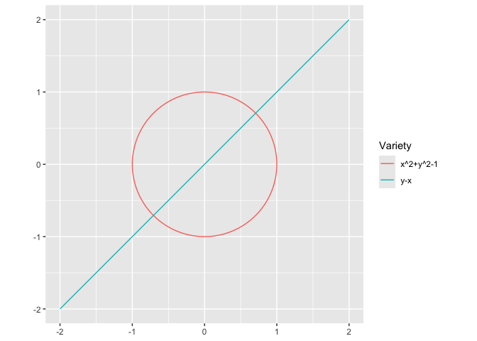

<!-- README.md is generated from README.Rmd. Please edit that file -->

# vnorm


[](https://cran.r-project.org/package=vnorm)
[](https://www.repostatus.org/#active)
[](https://github.com/sonish13/vnorm/actions/workflows/coverage.yaml)


The goal of vnorm is to sample from variety normal distributions. For
faster computation, several models are pre-compiled on installation. The
package also lets users pre-compile models for one polynomial shape and
reuse them for related polynomials with different coefficients. Other
uses include plotting 1D varieties in 2D and projecting points onto
varieties.

# Sampling from a variety

Generate samples from the variety normal distribution with mean equal to
`poly` and “standard deviation” equal to `sd`.

For a polynomial $x^2 + y^2 - 1$, we can sample using `rvnorm()`

``` r
library("vnorm")
poly <- mp("x^2 + y^2 -1")
samps <- rvnorm(2000, poly, sd = .1)
#> Pre-compiled Stan model not available (Stan model file "" not found.); falling back to regular rvnorm sampling.

head(samps)
#>            x          y
#> 1  0.8887164 -0.7311284
#> 2 -0.1166871 -0.9240324
#> 3 -0.1723317 -0.9846079
#> 4 -0.1945000  0.9704444
#> 5 -0.9364913 -0.3389791
#> 6  0.9615501  0.2898830

str(samps)
#> 'data.frame':    2000 obs. of  2 variables:
#>  $ x: num  0.889 -0.117 -0.172 -0.194 -0.936 ...
#>  $ y: num  -0.731 -0.924 -0.985 0.97 -0.339 ...
```

Let’s plot this with ggplot:

``` r
library("ggplot2")
#> 
#> Attaching package: 'ggplot2'
#> The following object is masked from 'package:vnorm':
#> 
#>     vars
ggplot(samps, aes(x = x , y = y)) +
  geom_point() +
  coord_equal()
```


We can use pre-compiled Stan models for polynomials with degree up to 3
and at most 3 indeterminates. This avoids repeated Stan compilation.

``` r
poly <- mp("x^2 + y^2 + z^2 - 1")
samps <- rvnorm(2000, poly, sd = 0.1, pre_compiled = TRUE)
#> Pre-compiled Stan model not available (Stan model file "" not found.); falling back to regular rvnorm sampling.
head(samps)
#>            x           y          z
#> 1 -0.5028331  0.96101968 -0.2335738
#> 2  0.7597490  0.03645026  0.8039279
#> 3 -0.3761774 -0.37603488 -0.9074592
#> 4  0.5714691 -0.26910431  0.9604254
#> 5 -0.2763946  1.07031320  0.2693057
#> 6 -0.6681854  0.35681038  0.8555868
```

We also want the user to be able to pre-compile models. This can be done
with \[compile_stan_code()\]. This helps avoid re-compiling Stan models
for similar polynomials with different coefficients.

``` r
poly <- mp("x^4 + y^4 - 1")
compile_stan_code(poly = poly)
#> compiled_stan_info cache created in package namespace
#> data {
#>   real si;
#>   real bx4;   real by4;   real b1;
#> }
#> parameters {
#>   real x;
#>   real y;
#>  }
#> model {
#>   real g = bx4*x^4+by4*y^4+b1;
#>   real dgx = 4*bx4*x^3;  real dgy = 4*by4*y^3;
#>   real ndg = sqrt(dgx^2 + dgy^2);
#>   target += normal_lpdf(0.00 | g/ndg, si); 
#> }
```

Here we compile a Stan model for polynomials of the form
$ax^4 + by^4 - 1$. We can then reuse that model in `rvnorm()` for
similar polynomials by setting `user_compiled = TRUE`.

``` r
poly <- mp("2 x^4 + 3 y^4 - 1")
samps <- rvnorm(1000, poly = poly, sd = 0.1, user_compiled = TRUE)
head(samps)
#>            x          y
#> 1 -0.8406088 -0.2269716
#> 2 -0.7994750 -0.5159492
#> 3 -0.7906269  0.4938070
#> 4 -0.7830172  0.4300515
#> 5 -0.8491667  0.4526503
#> 6 -0.3709381  0.7529136
```

# Plotting

`vnorm` includes `geom_variety()`, a ggplot2-compatible geom for
plotting 1D varieties. It supports single-polynomial (`mpoly`) and
multi-polynomial (`mpolyList`) inputs.

``` r
ggplot() +
 geom_variety(poly = mp("y - x^2")) +
 coord_equal()
```


``` r
ggplot() +
  geom_variety(
    poly = mp(c("x^2 + y^2 - 1", "y - x")) ,
    xlim = c(-2, 2), ylim = c(-2, 2)) +
  coord_equal()
```



## Installation

You can install the development version of vnorm from
[GitHub](https://github.com/) with:

``` r
if (!requireNamespace("devtools")) install.packages("devtools")
devtools::install_github("dkahle/mpoly")
devtools::install_github("sonish13/vnorm")
```
