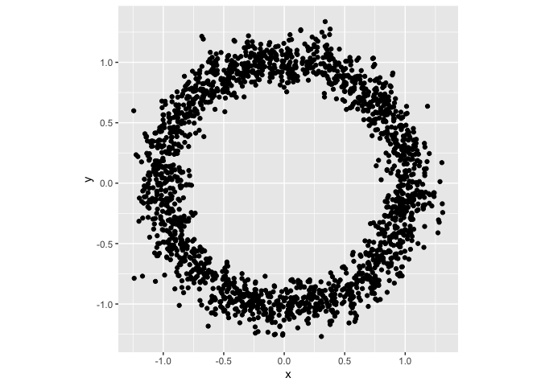

<!-- README.md is generated from README.Rmd. Please edit that file -->

# vnorm

The goal of vnorm is to sample from variety normal distributions. For
faster computation, several models are pre-compiled upon installation.
See below for more information. The package also enables users to be
able to pre-compile models for certain polynomials and let them use it
for similar polynomials with different coefficients. Other usage include
plotting 1d varieties in 2d plots and projection onto varieties.

# Sampling from a variety

Generate samples for the variety normal distribution with mean equal to
`poly` and “standard deviation” equal to `sd`.

For a polynomial $x^2 + y^2 - 1$, we can sample using `rvnorm()`

``` r
library("vnorm")
poly <- mp("x^2 + y^2 -1")
samps <- rvnorm(2000, poly, sd = .1)

head(samps)
#>            x           y
#> 1  1.0424484 -0.28906861
#> 2  0.2049675 -1.00055820
#> 3  1.0135166  0.05365435
#> 4 -0.9547829  0.57457430
#> 5 -0.8960134  0.55345625
#> 6 -0.8669832 -0.67256449

str(samps)
#> 'data.frame':    2000 obs. of  2 variables:
#>  $ x: num  1.042 0.205 1.014 -0.955 -0.896 ...
#>  $ y: num  -0.2891 -1.0006 0.0537 0.5746 0.5535 ...
```

Let’s plot this with ggplot:

``` r
library("ggplot2")
ggplot(samps, aes(x = x , y = y)) +
  geom_point() +
  coord_equal()
```



We can use pre-compiled stan models for polynomials with degree upto 3
and polynomial with up to 3 indeterminates. This helps avoid compiling
stan models.

``` r
poly <- mp("x^2 + y^2 + z^2 - 1")
samps <- rvnorm(2000, poly, sd = 0.1, pre_compiled = TRUE)
head(samps)
#>            x          y          z
#> 1  0.1717313  0.9413607 -0.2781185
#> 2 -1.0008663  0.1067377 -0.2108402
#> 3 -0.6693839 -0.3007711  0.8025284
#> 4 -0.6221259 -0.3855109  0.8487881
#> 5 -0.6262169 -0.3494986  0.8351000
#> 6 -0.1479208 -0.3299650  0.7932027
```

We also want the user to be able to pre-compile models. This can be done
with [compile_stan_code()]. This helps avoid re-compiling Stan models for
similar polynomials with different coefficients.

``` r
poly <- mp("x^4 + y^4 - 1")
compile_stan_code(poly = poly)
#> compiled_stan_info cache created in package namespace
#> data {
#>   real si;
#>   real bx4;   real by4;   real b1;
#> }
#> parameters {
#>   real x;
#>   real y;
#>  }
#> model {
#>   real g = bx4*x^4+by4*y^4+b1;
#>   real dgx = 4*bx4*x^3;  real dgy = 4*by4*y^3;
#>   real ndg = sqrt(dgx^2 + dgy^2);
#>   target += normal_lpdf(0.00 | g/ndg, si); 
#> }
```

Here we have compiled stan model for polynomial of the type \$ax^4 +
by^4 -1 \$. Now, we can use the pre-compiled model with rvnorm for
similar polynomial. The `user_compiled` argument is what we will use for
this.

``` r
poly <- mp("2 x^4 + 3 y^4 - 1")
samps <- rvnorm(1000, poly = poly, sd = 0.1, user_compiled = TRUE)
head(samps)
#>            x          y
#> 1 -0.1605150 -0.5952134
#> 2  0.5758295 -1.3549004
#> 3  0.5715470 -1.3394425
#> 4  0.7518394 -0.8295126
#> 5 -0.4074930 -0.8722190
#> 6 -0.3683330 -0.8202659
```

# Plotting

`vnorm` has `geom_variety` which is ggplot2 compliant in order to plot
1d varieties. We can plot varieties for single(mpoly object) or
multiple(mpolyList object) polynomails `geom_variety()`.

``` r
ggplot() +
 geom_variety(poly = mp("y - x^2")) +
 coord_equal()
```


``` r
ggplot() +
  geom_variety(
    poly = mp(c("x^2 + y^2 - 1", "y - x")) ,
    xlim = c(-2, 2), ylim = c(-2, 2)
  ) +
  coord_equal()
```


## Installation

You can install the development version of vnorm from
[GitHub](https://github.com/) with:

``` r
if (!requireNamespace("devtools")) install.packages("devtools")
devtools::install_github("dkahle/mpoly")
devtools::install_github("sonish13/vnorm)
```
